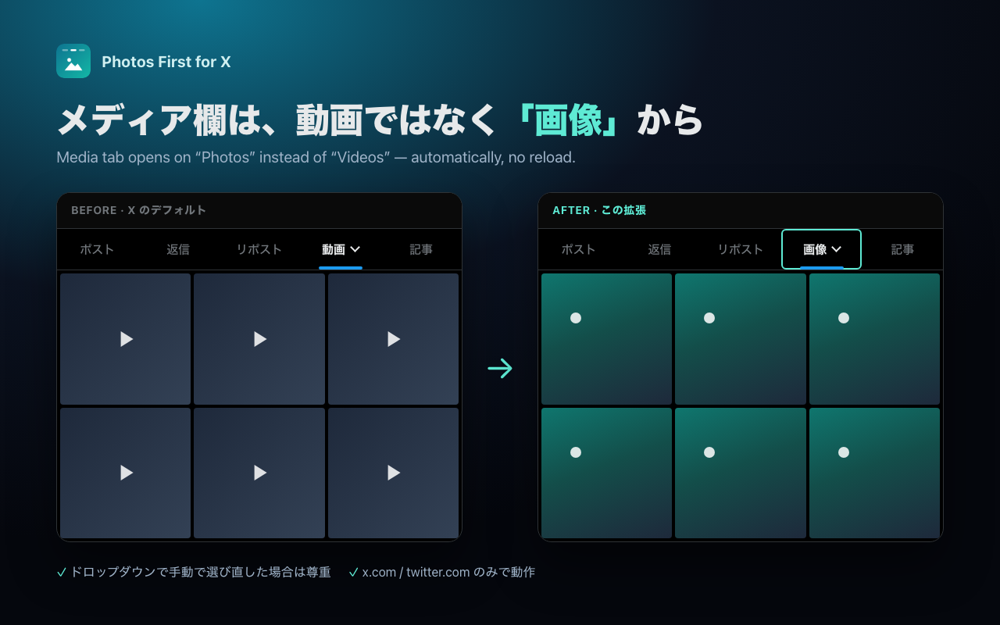

# Tab Defaults for X

X (x.com) のプロフィールを開いたとき、タブのデフォルトを自動で切り替える Chrome 拡張／ユーザースクリプト。

Open X profiles with **“All”** instead of “Posts” and **“Photos”** instead of “Videos” — automatically, without reloading.



| タブ | X のデフォルト | この拡張 | URL |
|---|---|---|---|
| ポスト ▾ | ポスト | **すべて** | `/{user}` → `/{user}/all` |
| メディア ▾ | 動画 | **画像** | `/{user}/media` → `/{user}/media?filter=photo` |

- ページリロードなし（`history.replaceState` + `popstate` で X のルーターに再描画させる）
- ドロップダウンから手動で「ポスト」「動画」を選び直した場合はそのまま（設定で無効化可）
- 対象は `https://x.com/*` と `https://twitter.com/*` のみ。通信・データ収集なし（[PRIVACY.md](PRIVACY.md)）
- MIT License

## インストール

### Chrome ウェブストア

（審査中）

### 手動（デベロッパーモード）

1. このリポジトリを clone / zip ダウンロード
2. `chrome://extensions` → 右上の **デベロッパーモード** を ON
3. **パッケージ化されていない拡張機能を読み込む** → このフォルダを選択
4. x.com を開き直す

### ユーザースクリプト（Tampermonkey / Violentmonkey）

[userscript/x-tab-defaults.user.js](userscript/x-tab-defaults.user.js) をインストール。設定はファイル先頭の `CONFIG` を編集。

## 設定

ツールバーのアイコンをクリック（または `chrome://extensions` → 詳細 → 拡張機能のオプション）。

| 項目 | 選択肢 |
|---|---|
| ポストタブ | すべて（既定）／ 変更しない |
| メディアタブ | 画像（既定）／ 変更しない |
| 手動選択を尊重 | ON（既定）／ OFF |

変更は開いている X のタブにも即反映されます。

## 仕組み

X の Web 版は表示するタブが URL で決まります。`page.js`（MAIN world）が `history.pushState` / `replaceState` / `popstate` をフックして遷移先を見張り、`/{user}` や `/{user}/media` を開いた瞬間に目的の URL へ `replaceState` して `popstate` を発火します。X のルーターはそれを受けて再描画するので、リロードなしでタブが切り替わります。設定は `bridge.js`（ISOLATED world）が `chrome.storage.sync` から読み、`CustomEvent` で `page.js` に渡します。

初回のフルロード（URL 直打ち・リロード）だけは例外で、X の起動前に `replaceState` で URL を差し替えると X が「このページは存在しません」を出す（初期ルートをサーバー埋め込み情報から決めているらしい）ため、まだ何も描画されていない `document_start` の時点で `location.replace()` による本物のリダイレクトを行います。描画前なので体感コストはほぼありません。

## テスト

```bash
node scripts/e2e-headless.mjs   # 拡張を読み込んだ headless Chromium で初回ロード / SPA 遷移 / 予約パス / 設定画面 / 拡張由来のコンソールエラーを確認
```

ログアウト状態の x.com を使うため、X 側の都合（ログイン誘導・旧 UI の A/B 配信）で一部 SKIP になることがあります。ログイン状態の挙動は実ブラウザで確認してください（[docs/publish-checklist.md](docs/publish-checklist.md) の手順 0）。

```
manifest.json
bridge.js        設定を storage から読んで page.js に渡す（ISOLATED world）
page.js          URL 監視と書き換え（MAIN world, document_start）
background.js    ツールバーアイコン → 設定画面
options.*        設定画面
_locales/        ja / en
userscript/      Tampermonkey 版（単体・設定はファイル内）
store-assets/    ストア用画像の生成（node store-assets/build.mjs）
docs/            掲載情報・公開手順
scripts/build-zip.sh      提出用 zip
scripts/e2e-headless.mjs  headless Chromium での動作確認
```

## 注意 / 既知の制限

- `/{name}` が全部プロフィールとは限らないため、`/home` `/explore` `/settings` などは `page.js` の `RESERVED` で除外しています。X が新しいトップレベルパスを追加して誤動作したら追加してください
- X 側の URL 仕様（`/all`, `?filter=photo`）が変わると動かなくなります → `computeRedirect()` を修正
- Chrome 111 以降（`world: "MAIN"` を使用）
- 本拡張は X Corp. と無関係の非公式ツールです

## 代替案

[Control Panel for Twitter](https://github.com/insin/control-panel-for-twitter) v4.24.0 には「プロフィールタブの変更を元に戻す」オプション（feature flag `responsive_web_profile_redesign_enabled` を無効化）があります。こちらは新タブ構成そのものを旧仕様に戻すアプローチです。

## License

MIT © 2026 tland
